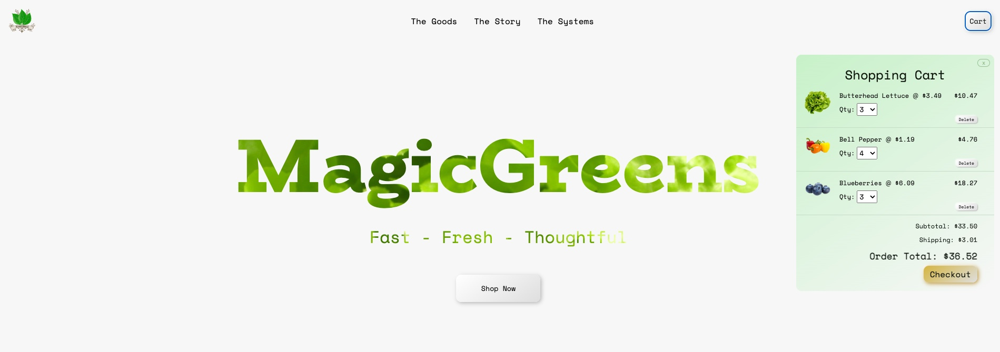

# MagicGreens

This project was designed to help improve my frontend skills by creating an e-commerce website for a hydroponics farm. The website allows users to browse and purchase different produce products, as well as learn about hydroponic farming.



See [Deployed Site](https://unrivaled-liger-b560c5.netlify.app/)

## Features

- Product catalog display with images, descriptions, and pricing information
- Shopping cart for selecting and purchasing products
- Responsive design for optimal viewing on different devices

## Tools & Technologies

- HTML, CSS, JavaScript
- ReactJS
- Redux for state management

## Installation & Setup

1. Clone the repository

    ```bash
    git clone https://github.com/xhillman/magicgreens.git
    ```

2. Navigate to the project directory

      ```bash
      cd magicgreens
      ```

3. Install the necessary dependencies
  
      ```bash
      npm install
      ```

4. Start the development server
  
      ```bash
      npm run dev
     ```

## Contributing

If you'd like to contribute to this project, feel free to create a pull request with your changes.

## License

This project is licensed under the MIT License.
